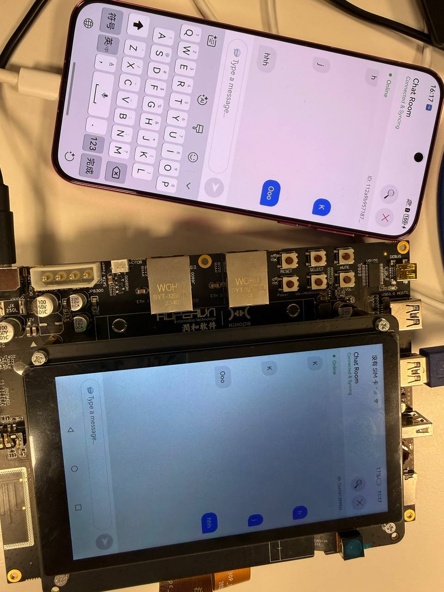

# Super Device Demo

[](https://opensource.org/licenses/Apache-2.0)
[](https://docs.openharmony.cn/)
[](https://github.com/imansmallapple/app-SuperDeviceDemo)

## Table of Contents

1. [Overview](#overview)
2. [Features](#features)
3. [Requirements](#requirements)
4. [Installation](#installation)
5. [Quick Start Guide](#quick-start-guide)
6. [Project Structure](#project-structure)
7. [Configuration](#configuration)
8. [Usage](#usage)
9. [Documentation](#documentation)
10. [Contributing](#contributing)
11. [Changelog](#changelog)
12. [License](#license)
13. [Contact](#contact)

## Overview

This demo showcases a simple implementation of cross-device data synchronization using the `distributedKVStore` module in OpenHarmony. After pairing devices on the same network and verifying a PIN code, the sender device can push messages to the receiver device through a distributed key-value store. The receiver listens for data changes and updates its state accordingly.

UI effects are as follows:



> **⚠️ Important Note:**
>
> This example uses system interfaces, so you need to manually replace the Full SDK to compile successfully. For specific steps, refer to the [Replacement Guide](https://docs.oniroproject.org/application-development/environment-setup-config/full-public-sdk/).

## Features

* 🔍 **Device Discovery** - Discover nearby devices on the same network
* 🔐 **Secure Pairing** - Authenticate and pair discovered devices using PIN code verification
* 📡 **Real-time Sync** - Send data from one device to another in real time
* 💾 **Distributed KV Store** - Utilize OpenHarmony's distributed key-value storage system
* 🔄 **Cross-device Communication** - Seamless data synchronization across paired devices

## Requirements

### Hardware Requirements
* Two OpenHarmony-compatible devices (e.g., `Dayu200 Development Board` and `OpenHarmony Developer Phone`)
* Valid network connection (both devices must be on the same network)

### Software Requirements
* OpenHarmony SDK API Level 11 or higher
* DevEco Studio 4.0 or higher
* System-level application privileges
* Valid signature configurations

### Permissions
* `ACCESS_SERVICE_DM` - For device discovery and management
* `DISTRIBUTED_DATASYNC` - For cross-device data synchronization

## Installation

### 1. Clone the Repository

```bash
git clone https://github.com/imansmallapple/app-SuperDeviceDemo.git
cd app-SuperDeviceDemo
```

### 2. Setup Development Environment

1. Install [DevEco Studio](https://developer.harmonyos.com/en/develop/deveco-studio)
2. Replace with Full SDK following the [official guide](https://docs.oniroproject.org/application-development/environment-setup-config/full-public-sdk/)
3. Configure system-level application settings (see [tutorial](https://docs.oniroproject.org/application-development/codeLabs/))

### 3. Build and Deploy

1. Open the project in DevEco Studio
2. Ensure you are using API level 11
3. Confirm your app is configured as a `system-level` application
4. Sign the application with valid signature configurations
5. Connect two OpenHarmony-compatible devices
6. Ensure both devices are connected to the same network
7. Click the **Run** button to install the application on both devices

## Quick Start Guide

### Step 1: Install the App on Both Devices
Ensure both devices support OpenHarmony and are connected to the same network.

### Step 2: Pair Devices

1. On the **initiating device**, tap the **Find Nearby Device** button
2. Select the target device from the pop-up list
3. A verification dialog will appear on the **receiver device**
4. Accept the pairing request on the receiver device
5. A random PIN code will be generated and displayed
6. Enter the PIN code on the **sender device**
7. Pairing is complete ✅

### Step 3: Determine Roles
Once paired:
* The **initiating device** is automatically labeled as the **Sender**
* The **target device** is labeled as the **Receiver**

### Step 4: Send Data

1. On the **Sender** device, enter text in the input box
2. Tap the **Send** button to push the message
3. The data is synchronized via the distributed KV store

### Step 5: Receive Data
The **Receiver** device will automatically receive and display the message in real-time.

### Step 6: Unbind Devices
Tap the **Unbind** button to disconnect the paired device and reset the session.

## Project Structure

```
app-SuperDeviceDemo/
├── AppScope/                    # Application scope configuration
│   ├── app.json5               # Application metadata
│   └── resources/              # Global resources
├── entry/                       # Main entry module
│   ├── src/
│   │   ├── main/
│   │   │   ├── ets/
│   │   │   │   ├── entryability/    # Application entry ability
│   │   │   │   ├── pages/           # UI pages
│   │   │   │   ├── utils/           # Utility classes
│   │   │   │   │   ├── DeviceManager.ets    # Device management
│   │   │   │   │   ├── kvStoreUtil.ts       # KV store operations
│   │   │   │   │   └── Log.ts               # Logging utility
│   │   │   │   └── view/            # Custom components
│   │   │   └── resources/          # Module resources
│   │   ├── ohosTest/               # Test files
│   │   └── mock/                   # Mock data
│   └── build-profile.json5         # Build configuration
├── hvigor/                      # Build tool configuration
├── images/                      # Documentation images
├── CHANGELOG.md                 # Version history
├── LICENSE                      # Apache 2.0 License
└── README.md                    # This file
```

## Configuration

### Application Configuration
Edit `AppScope/app.json5` to modify application metadata:

```json5
{
  "app": {
    "bundleName": "com.example.superdevicedemo",
    "vendor": "example",
    "versionCode": 1000000,
    "versionName": "1.0.0"
  }
}
```

### Permissions Configuration
Required permissions are defined in `entry/src/main/module.json5`:

```json5
{
  "requestPermissions": [
    {
      "name": "ohos.permission.ACCESS_SERVICE_DM"
    },
    {
      "name": "ohos.permission.DISTRIBUTED_DATASYNC"
    }
  ]
}
```

## Usage

### Device Manager API

```typescript
import DeviceManager from '../utils/DeviceManager'

// Discover nearby devices
DeviceManager.discoverDevices()

// Pair with a device
DeviceManager.pairDevice(deviceId)

// Unbind device
DeviceManager.unbindDevice(deviceId)
```

### KV Store API

```typescript
import KvStoreModel from '../utils/kvStoreUtil'

// Create KV store
const kvStore = new KvStoreModel()
kvStore.createKvStore(context, callback)

// Put data
kvStore.put(key, value)

// Get data
kvStore.get(key)

// Subscribe to changes
kvStore.subscribeDataChange(callback)
```

## Documentation

* [Tutorial](./Tutorial.md) - Detailed code explanations and architecture deep-dives
* [Changelog](./CHANGELOG.md) - Version history and release notes
* [Oniro Project Documentation](https://docs.oniroproject.org/) - Oniro project resources

## Contributing

Contributions are welcome! Please follow these steps:

1. Fork the repository
2. Create a feature branch (`git checkout -b feature/AmazingFeature`)
3. Commit your changes (`git commit -m 'Add some AmazingFeature'`)
4. Push to the branch (`git push origin feature/AmazingFeature`)
5. Open a Pull Request

Please ensure your code follows the project's coding standards and includes appropriate tests.

## Changelog

See [CHANGELOG.md](./CHANGELOG.md) for a detailed version history.

## License

This project is licensed under the Apache License 2.0 - see the [LICENSE](./LICENSE) file for details.


## Contact

* **Author**: imansmallapple
* **Repository**: [https://github.com/imansmallapple/app-SuperDeviceDemo](https://github.com/imansmallapple/app-SuperDeviceDemo)
* **Issues**: [https://github.com/imansmallapple/app-SuperDeviceDemo/issues](https://github.com/imansmallapple/app-SuperDeviceDemo/issues)
